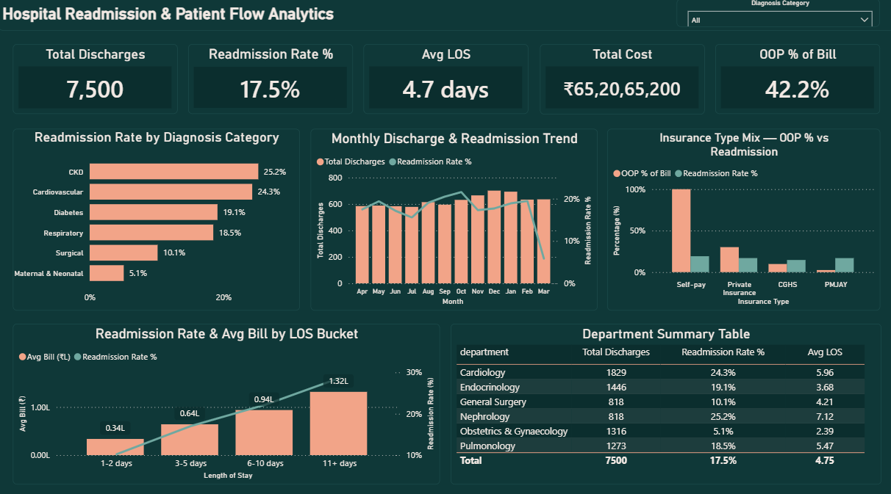
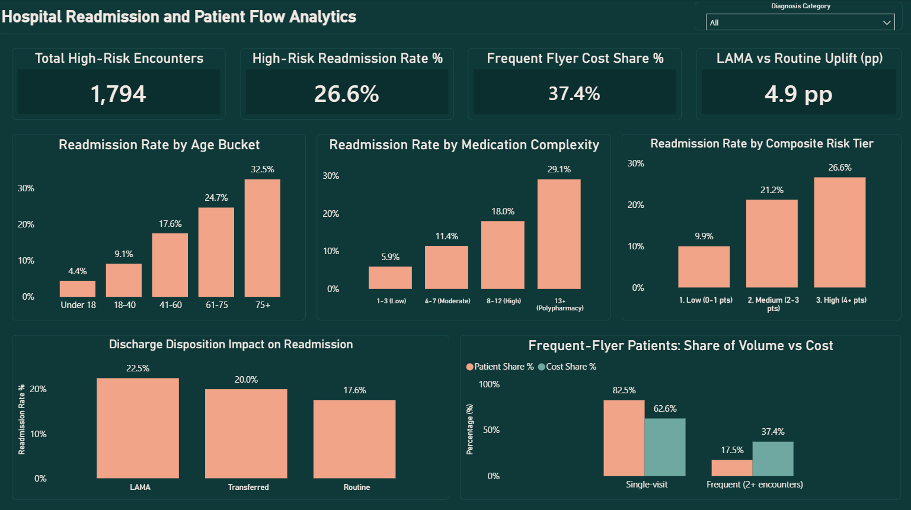

# Hospital Readmission & Patient Flow Analytics

**End-to-end hospital operations dashboard built with SQL Server, Python, and Power BI**

## Live Dashboard

**[View Interactive Dashboard →](ADD_POWER_BI_SERVICE_LINK_HERE)**

Published via Power BI Service — no login required, fully interactive.



---

## Business Problem

Hospitals lose money and quality-of-care ratings when patients are readmitted within 30 days of discharge. Without structured analysis, care teams have no clear view of:

- Which diagnosis categories and patient segments carry the highest readmission risk
- Whether shorter stays (early discharge) or longer stays (sicker patients to begin with) predict a comeback
- Whether out-of-pocket cost burden affects readmission — a genuine access-to-care question in an Indian hospital setting
- Whether a small group of repeat patients accounts for a disproportionate share of hospital cost
- Whether a simple, transparent score could flag high-risk patients at the point of discharge

Without this, discharge planning stays reactive — the same high-risk patients keep coming back, and there's no data to prioritize follow-up care for the people who actually need it.

---

## Solution

An analytics build covering 9,093 hospital encounters over one financial year (FY 2024-25) at a Delhi-NCR (National Capital Region) tertiary care hospital, tracing which patients, conditions, and care patterns actually drive 30-day readmission — checked and cross-matched across SQL, Python, and Power BI so the same numbers show up everywhere.

**What the dashboard shows:**
- 30-day readmission rate by diagnosis category, age group, and length of stay (LOS)
- Out-of-pocket (OOP — the portion of the bill the patient pays themselves) cost burden by insurance type, and how it relates to readmission
- A transparent 5-factor risk score that separates low-risk from high-risk patients
- The "frequent flyer" segment — a small group of repeat patients driving a large share of cost
- A confirmed link between medication count and comorbidity (multiple existing conditions) burden

---

## Tech Stack

| Tool | Purpose |
|------|---------|
| Python (Pandas, NumPy, Matplotlib, Seaborn) | Dataset build, data quality checks, EDA (exploratory data analysis), correlation analysis |
| SQL Server | Business-question queries — window functions, self-joins, CTEs (common table expressions) |
| Power BI (DAX) | Interactive 2-page dashboard |

---

## Dataset

No public, patient-level Indian hospital readmission dataset exists at usable scale — checked data.gov.in, PMJAY (Pradhan Mantri Jan Arogya Yojana, India's public health insurance scheme) claims data, NFHS (National Family Health Survey), and ICMR (Indian Council of Medical Research) publications. What's published is hospital-level summary statistics in research papers, not row-level data anyone can download.

So this dataset was built from scratch, calibrated against those same published Indian sources rather than pulled off Kaggle or randomized column-by-column.

**3 tables, 9,093 encounters:**

| Table | Rows | Description |
|-------|------|-------------|
| encounters_features_powerbi | 9,093 | Core fact table — one row per hospital stay |
| patients | 7,500 | Patient demographics, city/state, insurance type |
| doctors | 39 | Doctor details across 6 departments |

**How it was calibrated:**
- Diagnosis mix weighted to India's actual inpatient disease-burden ordering (Cardiovascular > Diabetes > Respiratory > Maternal & Neonatal > CKD, Chronic Kidney Disease > Surgical), based on ICMR disease-burden data
- Respiratory admissions weighted higher October–February, matching NCR's winter AQI (Air Quality Index)-driven admission spike
- Cardiovascular self-pay out-of-pocket costs calibrated to a median around ₹1.3 lakh, in line with the ₹1.15–1.72 lakh range reported in a published Indian tertiary-hospital cost study
- OOP burden scaled by insurance type: PMJAY ~2–3%, CGHS (Central Government Health Scheme) ~10%, Private Insurance ~25–30%, Self-pay 100%
- Readmission outcomes are driven by a risk model built on age, comorbidity count, medication count, LOS, insurance type, and discharge disposition — not assigned at random
- A small "frequent flyer" tail (patients with 3 admissions in the year) shows up concentrated in elderly, high-comorbidity chronic patients
- Overall 30-day readmission rate: 17.5%, ranging from 25.2% (CKD) down to 5.1% (Maternal & Neonatal)

This is a custom-built dataset representing a fictional hospital, not real patient records — the calibration anchors come from a handful of published single-hospital Indian studies, so treat them as directional rather than a validated national benchmark.

---

## Project Structure

```
hospital-readmission-patient-flow-analytics/
├── data/
│   ├── doctors.csv
│   ├── encounters.csv
│   ├── encounters_features_powerbi.csv
│   └── patients.csv
├── sql/
│   ├── 01_create_tables.sql
│   └── 02_business_questions.sql
├── python/
│   ├── eda.py
│   └── generate_data.py
├── powerbi/
│   └── hospital-readmission-patient-flow-analytics.pbix
├── Screenshots/
│   ├── page1_executive_overview.png
│   └── page2_risk_drivers.png
└── README.md
```

---

## Python EDA

`python/eda.py` handles data quality checks, feature engineering, distributions, and a correlation check across the encounter-level features. Two things worth calling out:

- Prior-admission count per patient (rolling 365-day window) was rebuilt independently in Python using a sorted time-window loop, as a check against the same logic built in SQL — both landed on identical patient counts (7,500 / 1,311 / 282 with 0 / 1 / 2 prior admissions).
- Medication count and comorbidity count correlate at **r = 0.73** — a strong relationship, confirming that medication complexity mostly reflects how many existing conditions a patient has, rather than acting as its own separate readmission driver.

`python/generate_data.py` builds the underlying dataset using the calibration described above.

---

## Dashboard — 2 Pages

### Page 1 — Executive Overview


**KPI Cards:** Total Discharges · Readmission Rate % · Avg LOS · Total Cost · OOP % of Bill

**Visuals:**
- Readmission Rate by Diagnosis Category — CKD and Cardiovascular highest at ~25%, Maternal & Neonatal lowest at 5.1%
- Monthly Discharge & Readmission Trend — the visible dip in March is a data-window effect (late-March discharges simply don't have 30 full days left in the year to be captured as a readmission), noted directly on the chart rather than left to look like a real trend
- Insurance Type Mix — OOP % vs Readmission — Self-pay patients carry 100% of their own bill and show the highest readmission rate
- Readmission Rate & Avg Bill by Length-of-Stay Bucket — both readmission risk and cost rise together as stays get longer
- Department Summary Table — department rates line up exactly with diagnosis category, confirming the doctor-department join is clean

---

### Page 2 — Risk Drivers & High-Risk Segments



**KPI Cards:** Total High-Risk Encounters · High-Risk Readmission Rate % · Frequent Flyer Cost Share % · LAMA (Left Against Medical Advice) vs Routine Uplift (percentage points)

**Visuals:**
- Readmission Rate by Age Bucket — the cleanest single driver in the project: a steady climb from 4.4% (under 18) to 32.5% (75+)
- Readmission Rate by Medication Complexity — the largest spread between buckets (5.9% → 29.1%), though this tracks comorbidity burden closely rather than acting on its own
- Readmission Rate by Composite Risk Tier — Low (9.9%) to High (26.6%), with most of the separation happening between Low and Medium rather than Medium and High
- Discharge Disposition Impact on Readmission — patients discharged LAMA show a real but modest increase in readmission versus a Routine discharge
- Frequent-Flyer Patients: Share of Volume vs Cost — patients with 2+ encounters make up 17.5% of the patient base but 37.4% of total cost

---

## Key Findings

| Finding | Value | Business Implication |
|---------|-------|---------------------|
| Overall 30-day readmission rate | 17.5% | Roughly 1 in 6 discharges comes back within a month |
| Highest-risk category | CKD, 25.2% | Nephrology discharge planning needs the most reinforcement |
| Lowest-risk category | Maternal & Neonatal, 5.1% | Acute, non-chronic care — the least readmission-prone segment |
| Age is the cleanest single driver | 4.4% (under 18) → 32.5% (75+) | Age alone is a strong discharge-planning signal, before any other factor is considered |
| Length of stay predicts both readmission and cost | 10.2% → 28.7% rate, roughly 4x cost increase | Extended stays are a quality issue and a cost issue together |
| Self-pay patients | 100% OOP, 19.2% readmission (highest) | Points to cost-driven early discharge and weaker follow-up affordability |
| Doctor-level variation | Small, consistent with sampling noise | Worth stating as a limitation — doctor assignment wasn't a factor in the underlying risk model |
| Medication complexity vs comorbidity | r = 0.73 | The biggest single spread in the project turns out to be a proxy for comorbidity, not an independent driver |
| Frequent-flyer cost concentration | 17.5% of patients → 37.4% of cost | A small, identifiable group is worth targeted discharge-planning attention |
| Composite risk score | Low 9.9% → High 26.6% | A simple, explainable scoring system separates risk meaningfully, especially between Low and Medium |

---

## DAX Measures

A few of the core measures, built in a dedicated `_Measures` table:

**Readmission Rate %**
```
Readmission Rate % =
DIVIDE([Readmitted Count], [Total Discharges]) * 100
```

**Total Discharges** (index stays only — the readmission-outcome filter lives inside the measure itself, not as a page-level filter, so a slicer can't accidentally hide it)
```
Total Discharges =
CALCULATE(
    COUNTROWS(encounters_features_powerbi),
    encounters_features_powerbi[is_readmission] = 0
)
```

**Frequent Flyer Cost Share %**
```
Frequent Flyer Cost Share % =
DIVIDE(
    CALCULATE([Total Cost], encounters_features_powerbi[is_frequent_flyer] = TRUE),
    [Total Cost]
) * 100
```

**Composite Risk Score**
```
RiskPoints =
VAR a = RELATED(patients[age])
VAR c = encounters_features_powerbi[comorbidity_count]
VAR p = encounters_features_powerbi[prior_admissions_365d]
VAR ins = RELATED(patients[insurance_type])
VAR disp = encounters_features_powerbi[discharge_disposition]
RETURN
    (IF(a >= 75, 2, IF(a >= 61, 1, 0)))
    + (IF(c >= 3, 2, IF(c = 2, 1, 0)))
    + (IF(p >= 1, 2, 0))
    + (IF(ins = "Self-pay", 1, 0))
    + (IF(disp = "LAMA", 1, 0))
```

---

## How to Run

**Regenerate the dataset (optional — the CSVs in `data/` are already built):**
1. `pip install pandas numpy`
2. `python python/generate_data.py` — builds `patients.csv`, `doctors.csv`, `encounters.csv`
3. `python python/eda.py` — builds `encounters_features_powerbi.csv`

**SQL setup:**
1. Open SQL Server Management Studio
2. Import the CSVs from `data/` using the Import Flat File wizard (Tasks → Import Flat File)
3. Import order: doctors → patients → encounters_features_powerbi
4. Run `sql/01_create_tables.sql`, then `sql/02_business_questions.sql`

**Power BI:**
1. Open `powerbi/hospital-readmission-patient-flow-analytics.pbix`
2. Home → Transform Data → Data Source Settings → point to your local `data/` folder
3. Refresh

**Or skip setup entirely:**
[Live Dashboard on Power BI Service](ADD_POWER_BI_SERVICE_LINK_HERE)

---

## Why This Project

Most fresher analytics portfolios lean on the same generic Kaggle US diabetes readmission dataset. This one is built around Indian healthcare instead — Indian disease-burden weighting, Indian out-of-pocket cost benchmarks, Indian insurance types and city/hospital context — after confirming no usable real Indian patient-level dataset exists publicly.

The same two results (prior-admission count, composite risk score) were independently worked out in both SQL and Python, using different techniques each time, and landed on identical numbers — a real check that the underlying logic holds up, not just two versions of the same calculation.

---

## About

Built as part of an independent data analytics portfolio to demonstrate end-to-end DA (data analyst) skills — dataset design grounded in real healthcare statistics, SQL, Python EDA, and Power BI dashboard development.

**Tools:** SQL Server · Power BI · DAX · Python · Pandas · NumPy · Matplotlib · Seaborn

**Domain:** Healthcare Analytics · Hospital Operations · Readmission Risk

**Connect:** [LinkedIn](https://www.linkedin.com/in/pratikshadandriyal) · [GitHub](https://github.com/pratikshadandriyal)

---

## Other Projects

- [Helpdesk Performance & SLA Analytics](https://github.com/pratikshadandriyal/Helpdesk-Performance-SLA-Analytics) — SQL Server + Power BI + Python, 8,000+ tickets, SLA (Service Level Agreement) breach and agent workload analysis
- [SaaS Product Analytics Dashboard](https://github.com/pratikshadandriyal/SaaS-Product-Analytics-Dashboard) — SQL Server + Power BI + Python, 45,000+ records, churn and feature adoption analysis
- [AI Job Displacement Dashboard](https://github.com/pratikshadandriyal/AI-Job-Displacement-Reskilling-Dashboard) — Power BI, 13,700+ job records across 9 countries
